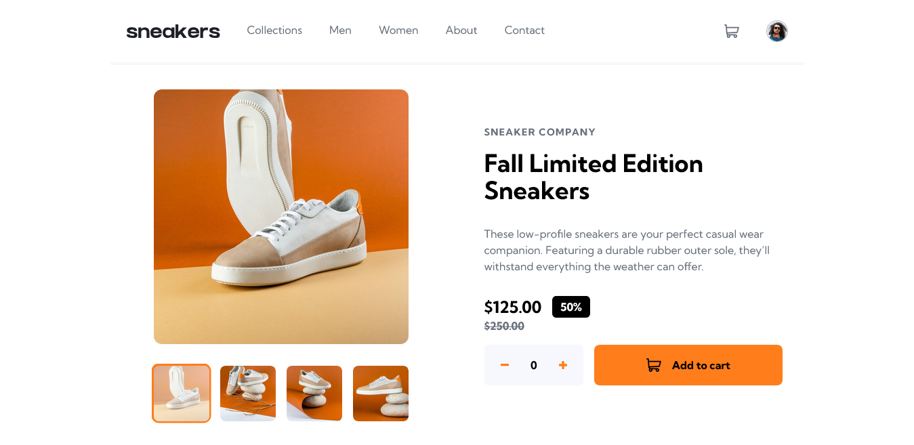

# Frontend Mentor - E-commerce product page solution

This is a solution to the [E-commerce product page challenge on Frontend Mentor](https://www.frontendmentor.io/challenges/ecommerce-product-page-UPsZ9MJp6). Frontend Mentor challenges help you improve your coding skills by building realistic projects.

## Table of contents

- [Overview](#overview)
  - [The challenge](#the-challenge)
  - [Screenshot](#screenshot)
  - [Links](#links)
- [My process](#my-process)
  - [Built with](#built-with)
  - [What I learned](#what-i-learned)
  - [Useful resources](#useful-resources)
- [Author](#author)

## Overview

### The challenge

Users should be able to:

- View the optimal layout for the site depending on their device's screen size
- See hover states for all interactive elements on the page
- Open a lightbox gallery by clicking on the large product image
- Switch the large product image by clicking on the small thumbnail images
- Add items to the cart
- View the cart and remove items from it

### Screenshot



### Links

- Solution URL: [https://www.frontendmentor.io/solutions/ecommerce-product-page-with-react-and-typescript-XGy6sgpy3N](https://www.frontendmentor.io/solutions/ecommerce-product-page-with-react-and-typescript-XGy6sgpy3N)
- Live Site URL: [https://ecommerce-product-page-main-alfi.vercel.app/](https://ecommerce-product-page-main-alfi.vercel.app/)

## My process

### Built with

- Mobile-first workflow
- [React](https://reactjs.org/) - JS library for building UI
- [Tailwind CSS](https://tailwindcss.com) - CSS Framework for styling
- [TypeScript](https://www.typescriptlang.org/) - Type-safe JavaScript
- [React Toastify](https://fkhadra.github.io/react-toastify/introduction) - For displaying user-friendly toast notifications

### What I learned

- Implement an image lightbox effect that enhances the product preview experience.
- Using `clsx` for cleaner conditional class names

  ```tsx
  <button
    onClick={onPrevious}
    className={clsx(
      'absolute flex cursor-pointer items-center justify-center rounded-full bg-white p-2 transition duration-300 hover:text-orange',
      {
        'top-1/2 left-4 h-10 w-10':
          navButtonPosition === 'inside' && navButtonSize === 'small',
        'top-1/2 -left-4 h-10 w-10':
          navButtonPosition === 'onEdge' && navButtonSize === 'small',
        'top-1/2 left-6 h-13 w-13':
          navButtonPosition === 'inside' && navButtonSize === 'medium',
        'top-1/2 -left-6 h-13 w-13':
          navButtonPosition === 'onEdge' && navButtonSize === 'medium',
      },
    )}
    aria-label="previous image"
  >
  ```

- Typing props and state in React with TypeScript

  ```tsx
  type ImageGalleryProps = {
    images: string[];
    thumbnails: string[];
    currentIndex: number;
    onImageClick: () => void;
    onThumbnailClick: (index: number) => void;
  };

  export default function ImageGallery({
    images,
    thumbnails,
    currentIndex,
    onImageClick,
    onThumbnailClick,
  }: ImageGalleryProps) {
    /* content */
  }
  ```

- Integrate `React Toastify` to display real-time feedback notifications.

  ```tsx
  // App.tsx
  export default function App() {
    return (
      {/* content */}
      <ToastContainer closeOnClick autoClose={4000} className="text-sm" />
    );
  }

  // ProductDetail.tsx
  const notifyAddToCart = (quantity: number): void => {
    if (!quantity || quantity <= 0) {
      toast.error('Please select a valid quantity before adding to cart');
      return;
    }

    const itemLabel = quantity === 1 ? 'item' : 'items';
    toast.success(`Successfully Added ${quantity} ${itemLabel} to your cart`);
  };

  const handleAddToCartClick = (): void => {
    notifyAddToCart(quantity);
    /* content */
  };

  return (
    <button onClick={handleAddToCartClick}>
      {/* content */}
    </button>
  )
  ```

### Useful resources

- [Lightbox example by w3schools](https://www.w3schools.com/howto/howto_js_lightbox.asp) - Helped me understanding how to create lightbox.
- [Using clsx for tailwindcss](https://shnoman97.medium.com/simplify-your-tailwind-css-class-management-with-merge-and-clsx-42f1e2458fd8) - This is an article which helped me finally understand using clsx for tailwindcss.
- [Official documentation how to use typescript on react](https://react.dev/learn/typescript) - For understanding how to use typescript on react.
- [React Toastify Docs](https://fkhadra.github.io/react-toastify/introduction) - To learn how to show and customize toast notifications easily.

## Author

- Website - [Muhammad Alfi Zain](https://muhammad-alfi-zain.vercel.app/)
- Frontend Mentor - [@AlfiZain](https://www.frontendmentor.io/profile/AlfiZain)
